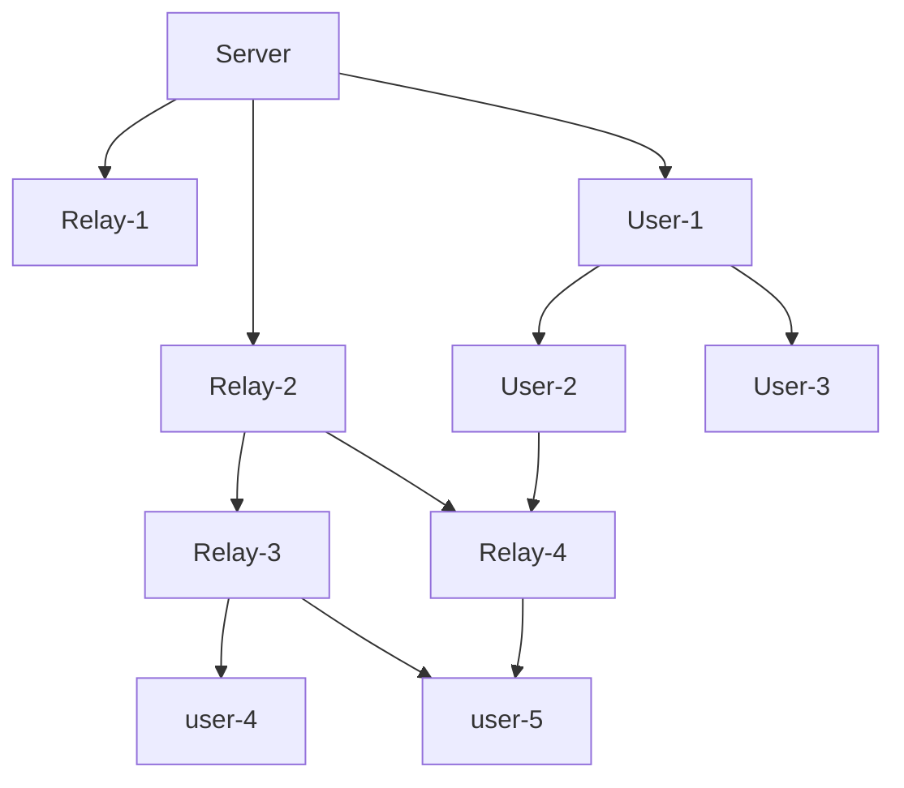

# TAK-imagery instructions

you have to get the atak software from the tak.gov page ( you can only access the download page with an account )
these are only satellite images for TAK software ( Wintak and ATAK )

DTED0 World folder has to be zipped and later imported use z-zip or any other software to do it

Then you can import each folder from the repository do not import the full zip since it contains the GitHub properties files
 
# How do I add these maps to ATAK ?

!!!! REMEMBER TO NOT UPLOAD THE FULL ZIP FILE BUT EACH FOLDER THAT CONTAINS MAPS SEPARATELY !!!

# Get the maps from a server
These is an example of a functional tack server deployment, were the nodes will autamticaly get the information needed from the closet/or factest relay point (users may also be used as a relay)

# ATAK ( Android Team Awareness Kit )

Android Team Awareness Kit, designed to be used in mobile devices with the android system from android 4

Available on most android devices ( do not download it from the Google app store go to the tak.gov page )

some devices may need external GPS I recommend the GotennaMESH and meshtastic antennas for communications

# WINTAK ( Windows Team Awareness Kit )

The native version of tak for windows

# Tracking funktion

Track each member from your team, these only work if you have a takserver and each member is connected to it

# Live information

Have live reports on weather and satellite images( only available from access to private servers )

# 3d maps

Elevation data with maps

